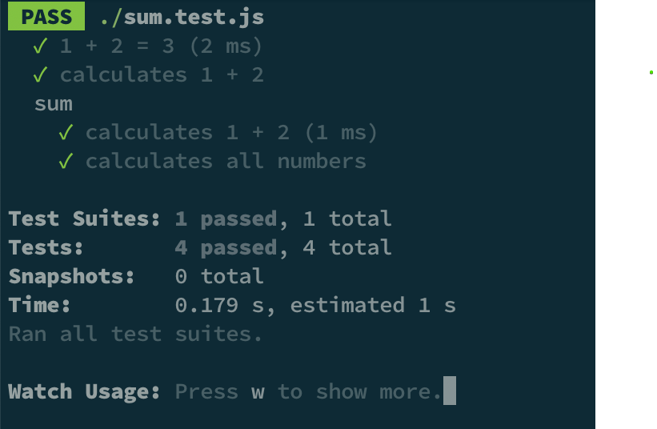
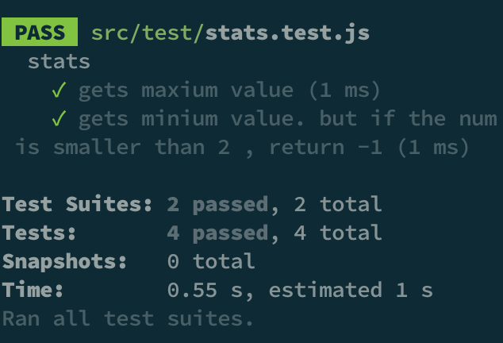

# 유닛 테스트

## 작업환경 설정

```shell
yarn add jest
```

VSC에서 인테리센스 지원

```shell
yarn add @types/jest
```

## 자바스크립트 테스트 튜토리얼

### 테스트 코드 설명

-   test / it
-   expect
-   toBe
-   describe

```shell
 - test는 새로운 테스트 케이스를 만드는 명령어 , *it으로 대체가능하다
 - expect는 특정 값이 ~일 것이다 라고 사전에 정의, 만약 통과를하면 테스트를 성공 시키고 통과하지 못하면 테스트를 실패 시킨다
 - toBe는 matchers로, 특정 값이 어떤 조건을 만족하는지, 또는 어떤 함수가 실행 됐는지, 에러가 났는지 확인 해 줌
 - describe를 사용해서 여러 테스트 케이스를 묶기
```

### 예제

```js
// sum.js

function sum(a, b) {
    return a + b;
}

function sumOf(numbers) {
    let result = 0;
    numbers.forEach((n) => {
        result += n;
    });
    return result;
}

exports.sum = sum;
exports.sumOf = sumOf;

// sum.test.js

const { sum, sumOf } = require('./sum');
test('1 + 2 = 3', () => {
    expect(sum(1, 2)).toBe(3);
});

describe('sum', () => {
    it('calculates 1 + 2', () => {
        expect(sum(1, 2)).toBe(3);
    });

    it('calculates all numbers', () => {
        const array = [1, 2, 3, 4, 5];
        expect(sumOf(array)).toBe(15);
    });
});
```

### 테스트 결과



### 리팩토링

코드 테스트를 확인 후에, 리팩터링하는 습관을 갖는 것이 좋다.
위 함수는 고차함수를 통해, 변수를 만들어야 하는 번거로움 있으니 forEach => reduce 배열 매서드를 통해 리팩터링.

```js
/**
 * 테스트 코드를 작성 했을 떄 얻을 수 있는 이점은,
 * 리팩토링 이후 코드가 제대로 작동하고 있는 것을 검증하기 매우 간편하다는 것이다
 */

function sumOf(numbers) {
    return numbers.reduce((acc, cur) => (acc += cur), 0);
}

exports.sumOf = sumOf;
```

## TDD

TDD(Test Driven Development)는 테스트 주도 개발이라는 의미로,
테스트가 개발을 이끌어 나가는 형태의 개발론을 의미한다.

선 테스트 코드 작성 -> 후 구현이며
실패, 성공, 리팩토링 3가지 절차로 이뤄져 있다.

### 실패

첫 번째 절차는 실패다. 의미는 실패하는 테스트 케이스를 먼저 만들라는 것이다. 실패하는 테스트 케이스를 만들 때는 프로젝트의 전체 기능에 대해 처음부터 모든 테스크 케이스를 작성하는 것이 아닌,

현재 가장 필요하고 구현해야할 기능을 하나씩 테스트 케이스를 작성하는 것이다.

### 성공

두 번째 절차는 성공이다. 실패한 테스트 케이스를 통과시키기 위하여 코드를 작성한다.

### 리팩터링

마지막 절차는 리팩토링이다. 테스트가 성공했다면 성공에 그치지 말고 리팩토링을 하여 코드를 개선할 필요가 있기 때문이다.

### 리팩터링 시 주의할 점

마틴 파울러에 의하면 기능구현 모자, 리팩토링 모자를 잘 구분해야 한다고 한다. 리팩토링 시, 눈에 밟히는 기능 구현 부분이 있을 때 경계 해야 한다.
그리고, 마틴 파울러가 말하듯이 리팩토링의 시작 점은 코드의 악취가 날 때, 3의 법칙 혹은 2의 법칙을 만났을 때 시작해야 한다.

1. 처음에는 그냥 한다.
2. 처음 비슷한 일의 중복이 생겼다는 사실을 알았을 때는 넘어가자
3. 비스한 일을 한 번 더 반복한다면 그 때 리팩터링을 하자.

단, 지저분한 코드를 발생해도 굳이 수정할 필요가 없다면 하지 말자, 그리고 리팩터링보다 새 코드를 작성하는 편이 나을 때는 하지 말자

## TDD 연습

### 최댓값 구하기

```js
// stats.test.js

const stats = require('../code/stats');

// max 함수 배열의 최댓값 구하는 테스터
describe('stats', () => {
    it('gets maxium value', () => {
        expect(stats.max([1, 2, 3, 4])).toBe(4);
    });
});

// stats.js

exports.max = (numbers) => {
    let result = numbers[0];
    numbers.forEach((n) => {
        if (n > result) {
            result = n;
        }
    });
    return result;
};

// 테스트 완료 후 리팩터링

exports.max = (numbers) => {
    // return Math.max(...numbers);
    // return numbers.reduce((acc, cur) => Math.max(acc, cur));
    return numbers.sort((a, b) => b - a)[0];
};
```

### 주어진 배열에서 최솟값을 구하라. 단, 숫자가 2보다 작을 경우 -1을 리턴

```js
// stats.test.js

describe('stats', () => {
    it('gets minium value. but if the num is smaller than 2 , return -1', () => {
        expect(stats.min([1, -2, -10])).toBe(-1);
    });
});

// stats.js

exports.min = (numbers) => {
    let result = numbers.sort((a, b) => a - b)[0];
    numbers.forEach((num) => {
        if (num < result) {
            result = num;
        } else if (num < 2) {
            result = -1;
        }
    });
    return result;
};

// 테스트 통과 후 리팩터링
exports.min = (numbers) => {
    return numbers.reduce((acc, cur) => {
        let miniumNum = Math.min(acc, cur);
        return miniumNum > 2 ? miniumNum : -1;
    });
};
```

```js
// 테스터 연속 실행

const stats = require('../code/stats');

// max 함수 배열의 최댓값 구하는 테스터
// min 함수를 구하지만 2보다 작을 땐 -1을 리턴하는 테스터
describe('stats', () => {
    it('gets maxium value', () => {
        expect(stats.max([1, 2, 3, 4])).toBe(4);
    });
    it('gets minium value. but if the num is smaller than 2 , return -1', () => {
        expect(stats.min([1, -2, -10])).toBe(-1);
    });
});
```

### 결과값



## 참고 자료

https://learn-react-test.vlpt.us/#/02-tdd-introduction
